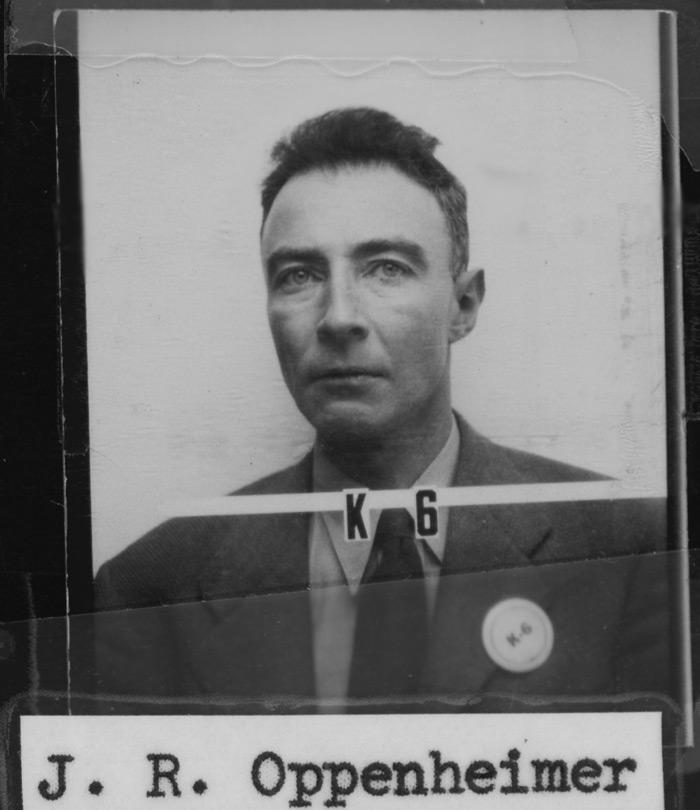

<!-- more -->

## 无责任评分

★★★★☆ 4.5

在高铁上用手机看完了本片，相比在影院观影的体验必定大打折扣，但它依然深深震撼了我。

观影后的几天，我的思绪还时常飘回洛斯·阿拉莫斯的荒原，见证天才们成就伟业，雨滴砸出阵阵涟漪，在蔚蓝色星球上绽放……

感性告诉我，这就是近几年我看过最好的电影。

在写之前，我还特地去看了一些电影老餮的评论，来找找吹这片子的角度。然而出乎意料他们对本片的评价并不是很高，可能是他们的标准太高导致的，我基本无法认同这些批判。

但是其中一个新闻引起了我的注意：

_《奥本海默》片尾删除80%特效员工署名_

这就很不地道了。实际上观众根本不在意你所标榜的“完全未使用CGI特效”，这套操作纯属画蛇添足。

另外，在热情冷却后再审视，本片的逻辑也确实存在瑕疵。爱因斯坦听到毁灭世界的反应，刘易斯·斯特劳斯忽大忽小的气量，以及各个阶段间奥本海默及其妻子行为的不连贯……

但总体瑕不掩瑜，它在我心目中依然是诺兰前三甚至 top1 的电影。

## 盗火

后续诺兰在访谈中提到，他拍摄本片的一个重要动机是这样一个事实：“从理论计算的概率上来看，有一个非常小的可能性他们无法排除，就是在‘三位一体’核爆测试中，有极小的可能会点燃大气层并毁灭世界。”。

我几乎认为这就是唯一原因，他就是为了这盘醋包的饺子。

一群天才冒着即便要毁灭世界的风险，依然按下按钮，替全人类做出了选择。这是探索者对普通人的责任，同样是一种傲慢，他们相信能够约束这力量，同时又不相信多数人的理性。诺导认为如果没发明原子弹今天的世界会更好，我无法认同。承担了使用火焰的风险，人类创造出璀璨的文明；同样承担使用核能的风险，文明才有可能离开襁褓。先驱者的忏悔和负罪，也只是代价的一部分。

**现代普罗米修斯为世人盗取了灭世之火，他同样将受到永世的赞颂和责罚。**

说回故事。相比起来听证会的部分简直像是向观众做出的妥协。它纯粹成为一个爽点，需要主角在压抑后的爆发。于是让奥本成为一个悲悯世人的天才，却不为世人理解，被小人所害。最后绝地反击，“或许他们在讨论一些更重要的事情”，以及凯蒂最后不握爱德华·泰勒的手。所有侮辱我的诋毁我的人都是错的，都要自食其果。代入完美被害者爽不爽？

我对一些高度赞扬这两个桥段的影评持鄙视态度。

## nearly zero

片尾揭示奥本海默跟爱因斯坦的私语，无法停止链式反应，最终毁灭世界。这里的画面表现让我眼前一亮，不同于庆功会那场戏，这里不仅没有任何惊悚与恐怖的元素，甚至可以说美不胜收，却描绘出了最恐怖的事情。这种反差制造出了一些疯狂的感觉，类似奇爱博士骑着核弹俯冲的场面，这种不适感是比直接描绘热核战争的可怕后果更高明，也更回味悠长。

就像片中科学家无法断言毁灭的概念绝对为零一样，谁又敢断言现代生活戛然而止绝无可能呢？

诺兰成长于一个被核阴影笼罩的时代，一个误判就会导致世界毁灭的疯狂虽然已经过去了近半个世纪，但今天的观众不会觉得这是一件多么天方夜谭遥不可及的事情。访谈里诺导对未来的预期是乐观的，即便今天是从冷战以来末日时钟离午夜最近的时代。这份恐惧不断地警醒世人，让所有人都忌惮它的的恐怖，它就越不会到来。

## 一些联想

大学时候我玩过一个游戏 《时空幻境》（braid），主人公追逐公主而不得被很多人解读为奥本海默想要将核能塞回潘多拉魔盒。

游戏是好游戏，但现在愈发觉得这个关联过于牵强。

另一个让我想起的则是 tno 的热核战争。

all gone 配合上在半空中蒸发的跳绳小女孩，耳边传来阵阵警报和哭号，地球上的灯光渐渐消失归于一片寂静。这个让人头皮发麻体验完全可以媲美《奥本》结尾，最好的反战教育。
