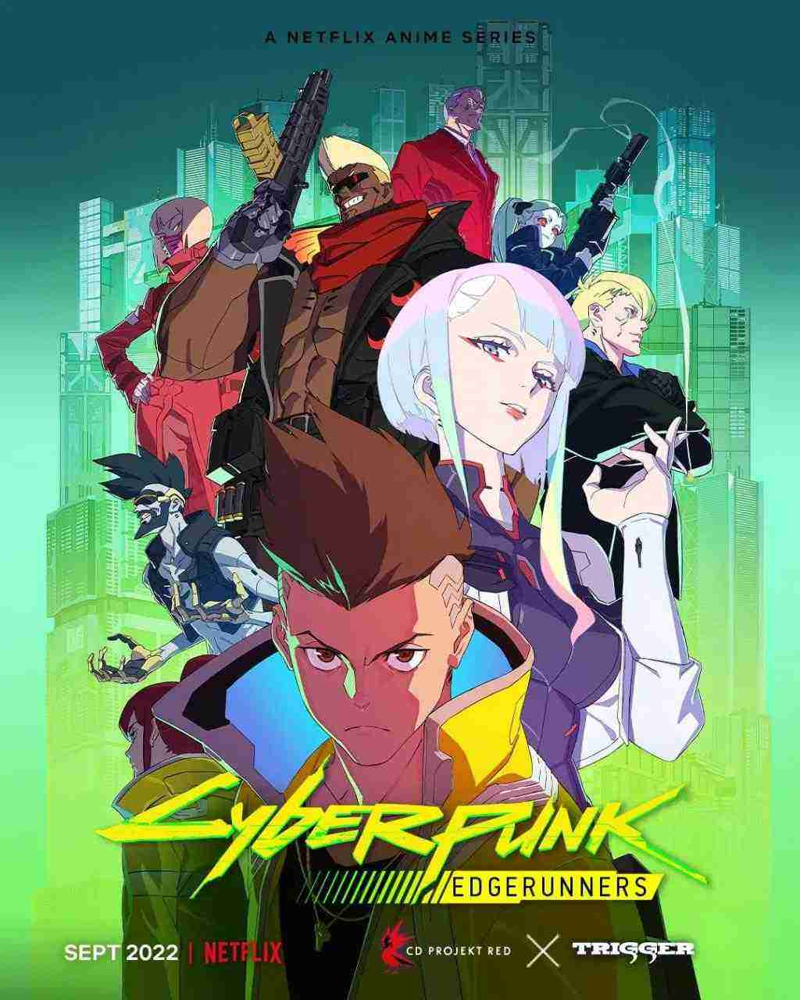
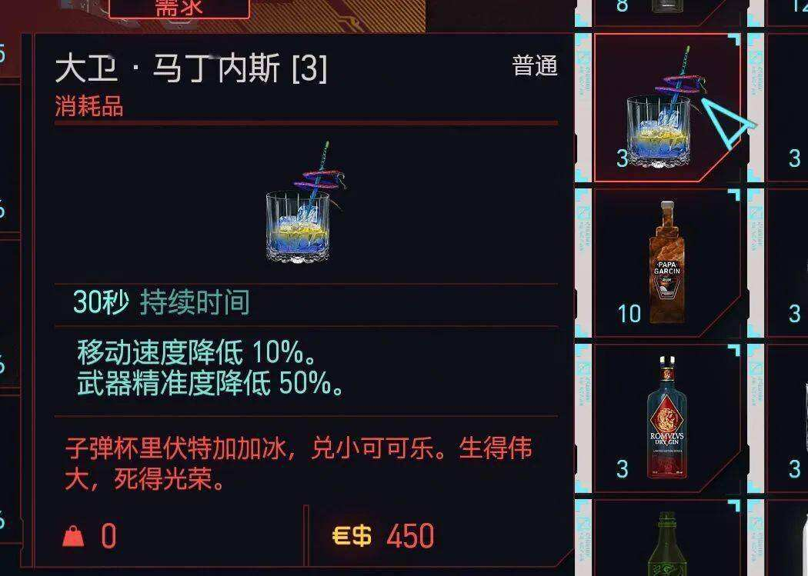

---
# 标题
title: 论不放飞自我的扳机社，上限有多高？——《赛博朋克：边缘行者》
# 短标题
# shortTitle: 
# 描述
# description: 
# 不是文章
# notArticle: true
# 图标
icon: article
# 作者
# author: 基本上无害
# 原创
isOriginal: true
# 写作时间
date: 2022-09-28
# 分类（可多个）
category:
  - 观后感
  - 动画片
# 标签（可多个）
tag:
  - 赛博朋克
  - 科幻
  - 热血
# 置顶
# sticky: true
# 收藏
# star: true
# 不添加至文章列表
# article: false
# 不添加至时间线
# timeline: false
# 预览图（绝对路径）
# image: 
# banner（横幅图片）
# banner: 
---

以我残躯化烈火

<!-- more -->

目前为止，我心目中的 2022 最佳动画出现了。

## 无责任评分

剧情：★★★★☆
（虽然有不能深究逻辑的点，但故事稳健，情绪到位，伏笔回收，令人回味）

画面：★★★★★
（今石洋之亲自下场作画保证，美术风格还原游戏，使用赛博色彩却没有像《普罗米亚》一样视觉疲劳）

音乐：★★★★★
（《I Really Want to Stay At Your House》、《This Fffire》已加入歌单，各插曲都令人影响深刻）

配音：★★★★★
（各位日语声优发挥稳定无可挑剔）

## 反响

由 扳机社 与 CDPR 合作的游戏改编剧集剧集 《赛博朋克：边缘行者》，于9月13日上线网飞平台。

一经发布，关于该剧的讨论瞬间席卷了所有二刺猿圈子，好评之声不绝于耳。

动画的超高人气，甚至反哺了原作游戏。
入土半截的 《赛博朋克：2077》 一度冲回了 steam 畅销榜第二名。
使得游戏制作人都发推感谢玩家“给了他们第二次机会”。

## 带着镣铐跳舞？

圈内对扳机社，一般有“强作画弱剧情”的既定印象。（原创动画限定）

突破天际的作画，超长的推进镜头，占满屏幕的红色大字，咆哮着无畏冲锋的热血主角，刺激度拉满。
然而与这种画面搭配的，往往是让人摸不着头脑的剧情，为燃而燃。

回归标题。网上最开始流传甚广的一种说法：本作的剧本是由 CDPR 方面拟定的，因为有了既定的故事大纲才扼住了扳机社放飞自我的翅膀。

然而事后从流出的信息来看，这次的剧本确实是**扳机社自己的功劳**。

据说 CDPR 确实为动画预先写好了一套剧本，在他们原定的剧本中，主角是中间人法拉第，从一个中间人的视角来观察夜之城，可能感觉上更类似相互独立的单元剧。

这套剧本交给扳机后当场遭到拒绝，并被直言“你们根本不懂动画”，并重新拟定了现在的故事大纲。

本作的主角 大卫·马丁内斯，一个在游戏中已经死亡的角色。
作为夜之城的传奇，死后他的名字被命名为一种鸡尾酒，放置在酒吧菜单里。

这就是这个角色在游戏中的所有相关内容。

游戏中的不着笔墨，给动画剧情有了自由发挥的空间：可以随意描绘一个无名小卒，怎么成长为名扬天下的传奇。
然而前提是 **他必须是死去的传奇**。

当然最后结果证明这个调整是正确的。

## 回避不了的悲剧与得不到的认可

### 结局

该剧的结局在网络上引起了大量讨论，其中看到最多的是三个字——“意难平”。

我在看完后也有种深深的无力感，这不光是因为结局的惨烈。而是我感觉即使回避了这一种 bad end，还有千百种更坏的结局在等待着主角团。
当然这可以归咎于男女主角别扭的性格，如果他们能多些沟通，或许能渡过这一次危机。

但是然后呢？

大哥曼恩的结局已近昭示了，只要大卫踏上了跟他同样的道路，最后的结局一定是自我毁灭，连带着自己的朋友与爱人。

从这种意味上来说，大卫死于非命，而且是为了保护女主而死，而且保持了理智、守住了自己的理想与尊严，成为传奇被人传送下去。

真正的以我残躯化烈火，没有比这个更好更浪漫的结局了。

### 动机

我相信多数人在观剧时，是把自己代入大卫的视角的。
然而到最后却不是很理解大卫的动机。

剧中有几个反复出现的意向来引导观众理解大卫。

1. 三次与至亲的离别：
母亲死前的倾诉，期望他爬到公司的顶端，成为精英改变命运；大哥死前的嘱托，继承了大哥的义手和团队；死前与 lucy 的告别；

2. “带你去月球”：
与 lucy 的第一次约会，对一见钟情的女孩定下的约定。

3. 寻求自我认可：
大卫希望听到那句“你一定可以的”，并且也一直相信（或尽力让自己相信）自己是特殊的。

先说一。剧中 lucy 说过大卫自己没有梦想，他的梦想就是替别人实现梦想。（卫宫士郎：你好）

但这并不能解释大卫的所作所为。
如果他想实现母亲的梦想，那他应该回到学院，而不是加入帮派；
如果他想实现大哥的梦想，目睹了大哥悲剧的他应该减缓自己的义体安装，照顾好身边的人，而不是去接法拉第所谓“高风险高回报”的任务。

其次二。“去月球”虽然在剧中首尾呼应了，但明显也不是大卫的首要目标。

剧中去月球的船票 25w 欧元，即使大卫凑不到那么多钱，正常的逻辑也是慢慢攒，保证团队的安全稳扎稳打，哪怕离开夜之城呢。
而大卫却不停氪命来加速这个过程，这不像是为了去月球的举动。更何况他清楚对 lucy 来说，“带你去月球” 中 “带你” 比 “去月球” 更重要。

最后就是自我认同的问题。

在这个视角下大卫所有的行动都能得到比较合理的解释。

被同学羞辱，违规导致家庭经济状况雪上加霜，母亲对自己满怀希望，自己却无法拯救她。
大卫对自己的价值产生了怀疑，为了证明自己他不惜赌命去安装斯安威斯坦。自我毁灭的倾向初现端倪。

得到超强的义体后，又阴差阳错加入了赛博朋克。在同伴的栽培和帮助下，逐渐找到自己的价值。
但好景不长。大哥战死之前，大卫为拯救大哥不顾全军覆没的风险试图以卵击石，最后又被劝解逃离。

继承团队后，一心希望 lucy 回归。被拒绝后的失落溢于言表，就好像 lucy 忌惮曾今的悲剧，不相信他能做得更好。

直到最后，他不得不证明自己的时候到了，哪怕知道那句 “我相信你可以” 可能是陷阱。

自始至终他都只是一个希望被认可的小孩。
