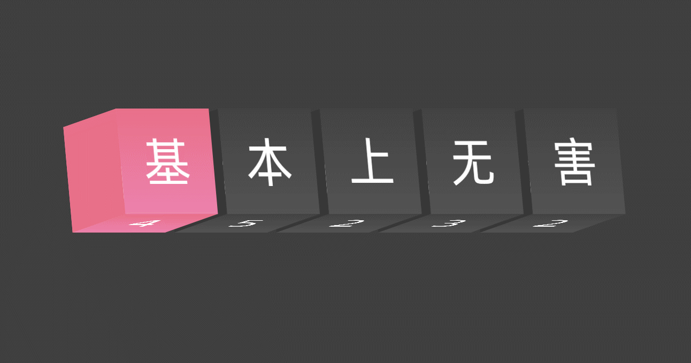
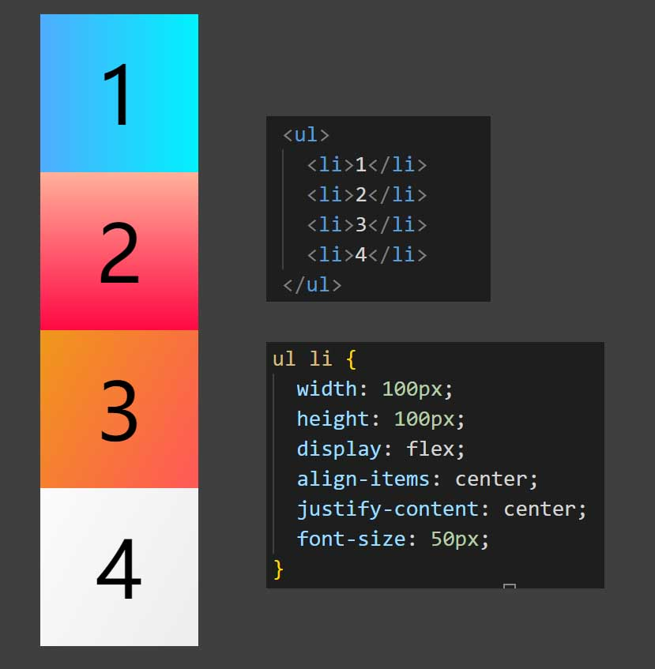
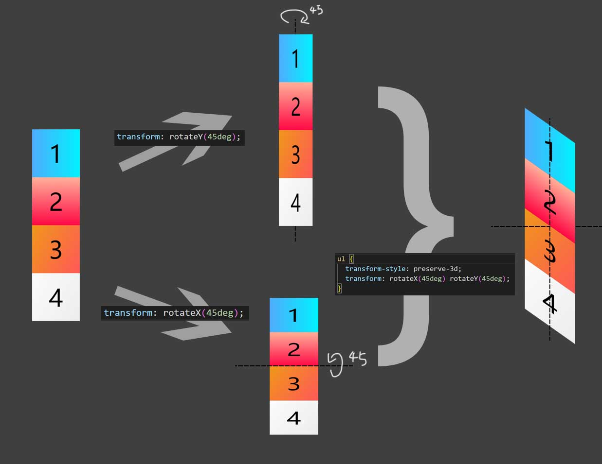

---
# 标题
title: CSS动画学习01：3D计数器
# 短标题
# shortTitle:
# 描述
# description:
# 不是文章
# notArticle: true
# 图标
icon: article
# 作者
# author: 基本上无害
# 原创
isOriginal: true
# 写作时间
date: 2022-10-27
# 分类（可多个）
category:
  - 前端
  - 小技巧
# 标签（可多个）
tag:
  - 前端
  - css
# 置顶
# sticky: true
# 收藏
# star: true
# 不添加至文章列表
# article: false
# 不添加至时间线
# timeline: false
# 预览图（绝对路径）
image: ""
# banner（横幅图片）
banner: ""
---

学习自 [哔哩哔哩 15 - 3D 计数器 (HTML+CSS) —— 创客界的一根葱](https://www.bilibili.com/video/BV1kd4y1z7Dr)

<!-- more -->

## 效果图

## 实现思路

1. 先学会用 html & css 画出一个 3D 立方体
2. 再弄出五个这样的立方体
3. 添加 hover 旋转效果

### 画 3D 立方体

