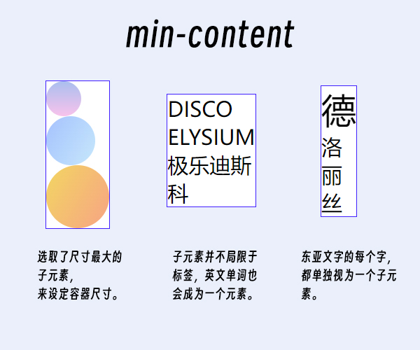
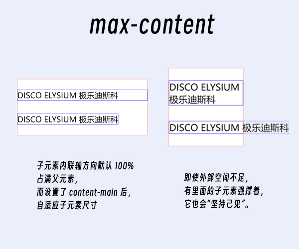
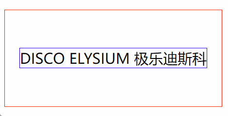

---
# 标题
title: 理解 CSS 的内在尺寸
# 短标题
# shortTitle: 
# 描述
# description: 
# 不是文章
# notArticle: true
# 图标
icon: article
# 作者
# author: 基本上无害
# 原创
isOriginal: true
# 写作时间
date: 2022-12-07
# 分类（可多个）
category:
  - 学习笔记
  - 技术
# 标签（可多个）
tag:
  - 前端
  - css
# 置顶
# sticky: true
# 收藏
# star: true
# 不添加至文章列表
# article: false
# 不添加至时间线
# timeline: false
# 预览图（绝对路径）
image: ""
# banner（横幅图片）
banner: ""
---

学习自：[(译) CSS min-content、max-content 和 fit-content 属性值介绍](https://juejin.cn/post/6844904065692909576)

彻底搞懂 `min-content`, `max-content`, `fit-content`。

<!-- more -->

## 理解什么是 **内在尺寸**

有内在尺寸就有外在尺寸。

外在尺寸：用精确的值指定元素的尺寸。

```css
div {
  height: 100px;
  inline-size: 20vw;
}
```

内在尺寸：**由元素内部的内容来动态地设定尺寸**。

```css
div {
  inline-size: min-content;
  block-size: max-content;
}
```

需要学习的内在尺寸属性有三个：`min-content`, `max-content`, `fit-content`。

## min-content

一言蔽之：**元素尺寸 = 所有子元素尺寸中最大的**

以一张图来说明：



## max-content

可以理解为子元素比较刚，强撑着父元素大小，不被更外层影响。



## fit-content

重头戏，这个属性是 `min-content` 和 `max-content` 的结合。

> `fit-content` 默许使用 `max-content`；
>
> 如果 可用空间 < `max-content`，那就使用 可用空间；
>
> 如果 可用空间 < `min-content`，那就使用 `min-content`。


